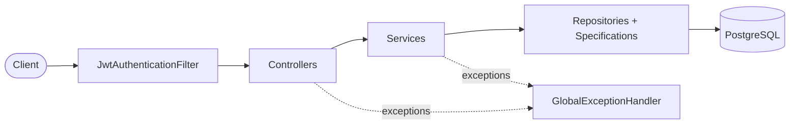
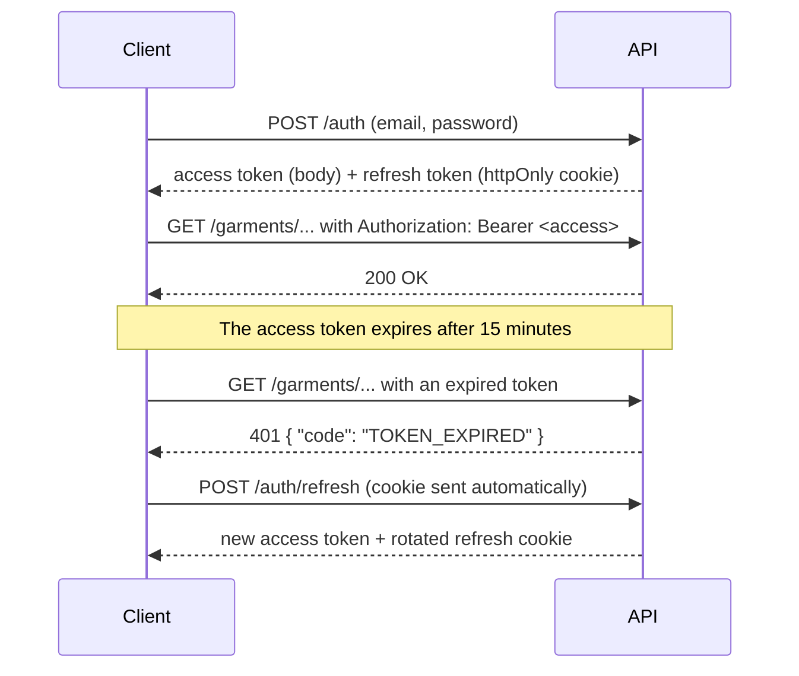

# Outfit Maker — Backend API

[](https://github.com/CatalinaCorrea-png/outfit-maker-backend-java/actions/workflows/ci.yml)


REST API for a virtual wardrobe: users catalog their garments, combine them into outfits, and browse them with filters.
The domain model is ready for AI-generated outfit suggestions with a user-rating feedback loop.

> Frontend: [outfit-maker-frontend-react-ts](#) (React + TypeScript)

---

## Highlights

- **Stateless JWT authentication with refresh token rotation.** Short-lived access tokens (15 min) travel in the `Authorization` header. Refresh tokens are single-use, rotated on every refresh, and delivered in an `httpOnly`, `SameSite=Strict` cookie, so JavaScript can never read them.
- **One error contract for the whole API.** Every error, including those raised inside the security filter chain where `@ControllerAdvice` does not reach, returns the same JSON shape with a stable, machine-readable `code` the frontend uses as its i18n key.
- **Entities never leave the service layer.** Responses are immutable DTOs built with Java records, so JPA internals, lazy proxies, and sensitive fields like password hashes are never serialized.
- **Queries designed to avoid N+1.** Open Session in View is disabled, so lazy-loading mistakes fail loudly in development instead of silently multiplying queries in production. Associations needed by each endpoint are fetched in a single query with `@EntityGraph`.
- **Composable, dynamic filtering.** Garment search is built from small JPA Criteria `Specification`s. Every filter is optional, and domain rules live in the query layer (for example, an `ALL_SEASONS` garment matches any season requested).
- **Soft delete.** Donated or sold garments are deactivated rather than removed, so historical outfits stay intact.

## Tech stack

| Area | Technology |
|---|---|
| Language | Java 21 (records, pattern matching for `switch`) |
| Framework | Spring Boot 4, Spring Web MVC |
| Security | Spring Security 7, JJWT 0.12 (HS256) |
| Persistence | Spring Data JPA, Hibernate 7, PostgreSQL 18 |
| Testing | JUnit 5, AssertJ, Mockito, H2 |
| Build and tooling | Gradle (Kotlin DSL), Docker Compose |

## Architecture



Controllers are thin: they map HTTP to service calls. Services own business logic and transactions and convert entities to DTOs. Repositories are Spring Data interfaces, and dynamic queries are composed in `specification/`.

### Authentication flow



## Getting started

**Prerequisites:** JDK 21 and Docker.

```bash
# 1. Start PostgreSQL and pgAdmin
docker compose up -d

# 2. Set the JWT signing key (at least 32 characters)
export JWT_KEY="replace-with-a-random-secret-of-32-plus-chars"

# 3. Run the API on http://localhost:8080
./gradlew bootRun
```

On startup the application seeds sample data. Demo users are `cher@gmail.com` and `dionne@gmail.com`, both with password `123`.

pgAdmin is available at http://localhost:5050 (`admin@admin.com` / `admin`). From inside pgAdmin, the database host is `db:5432`.

### Configuration

| Variable | Default | Description |
|---|---|---|
| `JWT_KEY` | *(required)* | HS256 signing key, at least 32 characters |
| `JWT_ACCESS_EXPIRATION` | `900000` (15 min) | Access token lifetime, in ms |
| `JWT_REFRESH_EXPIRATION` | `604800000` (7 days) | Refresh token lifetime, in ms |
| `DB_URL` | `jdbc:postgresql://localhost:5433/outfitmaker_sql` | JDBC URL |
| `DB_USERNAME` / `DB_PASSWORD` | `postgres` / `postgres` | Database credentials |
| `JPA_DDL_AUTO` | `create-drop` | Use `update` or migrations outside local development |
| `CORS_ALLOWED_ORIGINS` | `http://localhost:5173` | Comma-separated frontend origins |

## API overview

| Method | Endpoint | Auth | Description |
|---|---|---|---|
| `POST` | `/auth/register` | Public | Create an account |
| `POST` | `/auth` | Public | Log in. Returns the access token and sets the refresh cookie |
| `POST` | `/auth/refresh` | Refresh cookie | Rotate the refresh token and issue a new access token |
| `GET` | `/garments/filtered-garments` | Bearer | Paginated, filterable garment list |
| `GET` | `/outfits/filtered-outfits` | Bearer | Paginated outfit list, garments ordered by layer |
| `GET` | `/actuator/health` | Public | Health check |

**Garment filters** (all optional query params): `userId`, `category`, `name`, `brand`, `pattern`, `formality`, `season`, `active`. Pagination and sorting use `page` (default `0`), `pageSize` (default `6`), `sortBy` (`createdAt` or `name`), and `ascending` (default `true`). Inactive garments are excluded unless `active` is set explicitly.

```bash
curl "http://localhost:8080/garments/filtered-garments?season=SUMMER&formality=2" \
  -H "Authorization: Bearer <access token>"
```

### Error format

```json
{
  "status": 401,
  "code": "AUTH_INVALID_CREDENTIALS",
  "error": "Credenciales inválidas",
  "detail": "El email o la contraseña son incorrectos.",
  "timestamp": "2026-09-22T14:32:11-03:00"
}
```

Clients should branch on `status` and translate `code`. The `detail` field is a human-readable message meant for debugging.

## Testing

```bash
./gradlew test
```

Tests run under a dedicated `test` profile backed by an in-memory H2 database, so they need neither Docker nor a `JWT_KEY`. Seed data is disabled in that profile, and each test builds its own fixtures.

The suite is organized as a test pyramid:

| Level | Scope | Tooling |
|---|---|---|
| Unit | Token issuing and verification, domain rules, request defaults, services | JUnit 5, AssertJ, Mockito (no Spring context) |
| Slice | Specifications against a real database, controllers and error handling | `@DataJpaTest`, `@WebMvcTest` |
| Integration | Full auth flow: register, login, protected access, refresh | `@SpringBootTest` + MockMvc |

## Project structure

```
src/main/java/ar/outfitmaker/
├── bootstrap/       sample data for local development
├── config/          security filter chain, JWT filter, CORS, beans
├── controller/      REST endpoints
├── domain/          JPA entities and enums
├── dto/             request/response records and pagination
├── errors/          exception hierarchy and global handler
├── repository/      Spring Data repositories
├── service/         business logic and transactions
└── specification/   composable JPA Criteria filters
```

## Roadmap

- [ ] AI-generated outfit suggestions (`aiGenerated`, `aiPrompt`, and `rating` are already modeled)
- [ ] Outfit filtering with Specifications
- [ ] Persist refresh tokens in Redis or the database (currently in memory, lost on restart)
- [ ] Enable the `Secure` cookie flag for HTTPS deployments
- [ ] Database migrations with Flyway
- [ ] OpenAPI documentation
- [ ] Integration tests against real PostgreSQL with Testcontainers
- [ ] CI pipeline with GitHub Actions and a container image

## Background

The API was first prototyped in Kotlin and then migrated to Java 21 and Spring Boot 4. The migration was also used to fix issues found along the way, including mismatched repository ID types, an endpoint that serialized JPA entities directly (infinite recursion and an exposed password hash), a registration route blocked by the security config, and refresh-token expiry handling that returned 500 instead of 401.

## Contact

**Catalina Correa** — [LinkedIn](https://www.linkedin.com/in/catalina-yazmin-correa/) · [GitHub](https://github.com/CatalinaCorrea-png)
